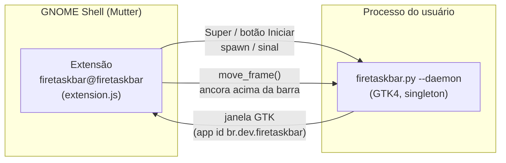

# Arquitetura — FireTaskBar

Documento técnico para quem mantém o projeto. Para instalar/usar, veja o
[README](README.md).

## Visão geral

O FireTaskBar são **duas partes** que se comunicam pelo gerenciador de janelas:



| Parte | Arquivo | Papel |
|-------|---------|-------|
| **Launcher GTK4** | `firetaskbar.py` | Daemon singleton; desenha o menu (busca, categorias, cards, rodapé). |
| **Extensão GNOME** | `~/.local/share/gnome-shell/extensions/firetaskbar@firetaskbar/extension.js` | Barra de tarefas inferior (estilo Dash to Panel) + **ancora** a janela do menu na tela. |

## Ciclo de vida do menu (daemon singleton)

O menu **não** é recriado a cada abertura. Ele vive como daemon:

- **Abrir** → `mostrar()` chama `present()` na janela já existente.
- **Fechar** → `do_close_request()` faz `set_visible(False)` (apenas esconde; não destrói).

Consequência importante: a janela é **criada uma vez** (sinal `window-created`
do Mutter dispara só nessa vez), mas **mapeada toda vez** que reabre (sinal
`map`).

## Posicionamento (por que o GNOME não usa layer-shell)

Em compositores **wlroots**, o `firetaskbar.py` se ancora sozinho via
`gtk4-layer-shell`. No **GNOME/Mutter não existe `wlr-layer-shell`**, então quem
posiciona a janela é a **extensão**, com `meta_window.move_frame()`.

A extensão ancora a janela **colada no topo da barra**:

- `_positionMenu(win)` usa o **topo real da barra** (`get_transformed_position()`),
  não `monitor.height - barHeight`. Assim funciona tanto no modo **dock** (que
  flutua `DOCK_GAP = 8px` acima do fundo) quanto no modo **painel** (largura
  total).
- Sobrepõe `MENU_OVERLAP = 4px` para o menu parecer **sair de dentro da barra**,
  sem fresta.
- **Alinhamento horizontal** segue a config do menu (`menu_position`): a extensão
  lê `~/.config/firetaskbar/config.json` via `loadMenuPosition()` a cada
  posicionamento e ancora à **esquerda** (`mon.x + MENU_EDGE_MARGIN`), ao
  **centro** (padrão) ou à **direita** (`mon.x + mon.width - r.width -
  MENU_EDGE_MARGIN`). Antes era sempre centralizado — por isso a opção de posição
  "não fazia nada" no GNOME. Releitura por abertura: muda de lado na próxima vez
  que o menu abre (reancora no `map`).

### Reancorar em *todo* `map` (gotcha)

Como a janela é um daemon singleton, ancorar só em `window-created` faz o menu
ficar centralizado pelo Mutter em **todas as reaberturas seguintes**. Por isso a
extensão reancora a cada `map`:

```js
global.window_manager.connectObject(
    'switch-workspace', () => this._rebuild(),
    'map', (_wm, actor) => {
        const win = actor.meta_window;
        if (this._isMenuWindow(win)) this._trackMenu(win);
    },
    this);
```

Além disso, `_placeMenu` reconecta `position-changed` / `size-changed` para
reancorar caso o Mutter mova ou redimensione a janela.

Constantes relevantes em `extension.js`:

| Constante | Valor | Efeito |
|-----------|-------|--------|
| `DOCK_GAP` | `8` | Folga da barra (modo dock) em relação ao fundo da tela. |
| `DOCK_MARGIN` | `24` | Margem lateral da barra (modo dock). |
| `MENU_OVERLAP` | `4` | Pixels que o menu sobrepõe a barra (cola nela). |

## Barra de tarefas — largura dos botões

Cada app vira um botão na `_winList` (`St.BoxLayout` horizontal). Tipos:

| Classe | Quando | Estrutura |
|--------|--------|-----------|
| `GroupButton` | App com ≥1 janela (agrupa todas as janelas do mesmo app) | `St.Button` → `container` (`BinLayout`) com `_inner` (ícone + label) + `_indicator` + `_count` (badge) |
| `PinnedButton` | App fixado **sem** janela aberta (launcher) | `St.Button` → `container` (`BinLayout`) com ícone + `_indicator` |

### Invariante: no modo só-ícone todos os botões têm a MESMA largura

Sintoma histórico: um app agrupado (ex.: **Brave** com 2 janelas) aparecia mais
largo que apps de 1 janela. Duas causas distintas já foram corrigidas:

1. **Estiramento por `x_expand`** (resolvido): o botão herdava `needs_expand` e
   "puxava" o espaço livre da lista → `x_expand: false` explícito no botão **e**
   no `container`.
2. **Largura por conteúdo agrupado** (resolvido): badge `_count` e indicador
   `grouped` são filhos do `BinLayout`, que dimensiona pelo **maior** filho (não
   pela soma) — logo, em tese, não alargam. Mesmo assim, para garantir, existe a
   invariante `Bar._normalizeBtnWidths()`.

```js
// Modo só-ícone: força largura idêntica (ícone + padding) em TODO botão.
// Modo ícone+nome: set_width(-1) → largura natural (cada nome tem seu tamanho).
_normalizeBtnWidths() {
    const labelMode = (this._cfg.mode || DEFAULT_MODE) === 'icons_names';
    for (const btn of [...this._btns.values(), ...this._pBtns.values()]) {
        if (labelMode) { btn.set_width(-1); continue; }
        const node = btn.get_theme_node();
        const pad  = node.get_padding(St.Side.LEFT) + node.get_padding(St.Side.RIGHT);
        btn.set_width(Math.max(44, Math.round(this._iconSize() + pad))); // 44 = min-width do CSS
    }
}
```

Chamada em **`_rebuild`** (após montar a lista), **`_applySize`** (mudou
tamanho/altura) e na **troca de modo** (`_onConfigChanged`). Assim a largura é
idêntica independente de agrupamento, badge de contagem ou estado de fixado.

> ⚠️ Botões de tamanho fixo numa lista nunca devem ter (nem herdar) `x_expand`.
> A signature "ícone centralizado dentro de uma caixa larga e vazia" = botão
> sendo **alocado** mais largo que o conteúdo (estiramento), não largura
> preferida.

### Gotcha oposto: alinhar filho num `BinLayout` exige `x_expand`

Nos cards de prévia de janela (`_makeCard`), o botão **fechar (x)** caía
centralizado sobre o ícone em vez do canto superior direito. Num
`Clutter.BinLayout`, `x_align`/`y_align: END/START` do filho **só posicionam se o
filho tiver `x_expand: true` e `y_expand: true`** — sem expand o layout
centraliza. Com `x_align: END` (não `FILL`) o ator mantém o tamanho natural e só
encosta no canto, não estica. (Mesma família do aviso acima, sentido oposto.)

## Configuração do menu (`~/.config/firetaskbar/config.json`)

Config própria do launcher (distinta de `~/.config/firetaskbar.json`, que é da
extensão). Defaults em `_CONFIG_PADRAO`:

| Chave | Valores | Quem consome | Efeito |
|-------|---------|--------------|--------|
| `menu_position` | `left` / `center` / `right` | **extensão** (`_positionMenu`) | Alinhamento do menu na barra. |
| `menu_width` | `estreito` / `medio` / `largo` → `520`/`640`/`760 px` (`_LARGURAS`) | launcher (`_aplicar_largura`) | Largura da janela (`self._raiz.set_size_request`). A extensão recentraliza no `map` seguinte. |
| `menu_color` | string RGBA ou `null` | launcher (`_aplicar_tema`) | Cor base do tema; `null` = herda a cor da barra (`_ler_cor_barra`). |
| `bar_height` | px | launcher (`_aplicar_config`) | **Só no caminho layer-shell/wlroots** (margem inferior). No GNOME a altura é automática. |
| `pinned` / `recent` | lista de app ids | launcher | Fixados / recentes. |

> 🔗 **Leitura cruzada:** `menu_position` é gravado pelo **launcher** e lido pela
> **extensão**. É a única config do menu que a extensão consulta — o resto é
> aplicado pelo próprio processo GTK.

### Diálogo "Configurações do Menu" (`DialogPreferencias`)

Aberto pela engrenagem do rodapé (`_abrir_preferencias`). Seções: **Aparência**
(largura + cor) e **Posição do menu na barra** (esquerda/centro/direita).
Ao **Aplicar**: salva o `config.json` e reaplica ao vivo
`_aplicar_config()` + `_aplicar_largura()` + `_aplicar_tema()`.

> ⚠️ **Gotcha (layer-shell):** o diálogo **não** pode ser `transient_for` da
> janela do menu. O menu é superfície overlay que se auto-esconde ao perder foco;
> um transiente dela fica sem pai válido no Wayland e **nunca mapeia**. Por isso
> `_abrir_preferencias` esconde o menu, cria o diálogo como toplevel da aplicação
> (`set_application`) e guarda a referência (`self._dlg_pref`) para não ser
> coletado.

> ℹ️ A **altura da barra** foi removida do diálogo: no GNOME ela é automática (o
> menu cola na barra real). O campo só fazia sentido no caminho wlroots.

## Rodapé do menu

Linha inferior (`rodape`), fundo **transparente** (`.rodape`), com:

- **Perfil** (`_construir_perfil`): avatar + nome viram um `Gtk.Button` (`.perfil`)
  que abre a **Conta de Usuário** do GNOME (`_abrir_conta_usuario` →
  `gnome-control-center system users`; no GNOME 46+ "Usuários" migrou para o
  painel *System*).
- **Engrenagem**: abre o `DialogPreferencias`.
- **Ações de sistema** (sem popover, direto no rodapé via `_botao_energia`):
  Configurações, Bloquear, Sair, Reiniciar, **Desligar** (este com realce
  vermelho `.btn-energia`). Cada uma chama `_acao_sistema`, que **esconde o menu
  antes** de lançar o comando (senão janelas como `gnome-control-center`
  abririam atrás da superfície overlay).

## Recarregar mudanças

| Mudou… | Como aplicar |
|--------|--------------|
| `firetaskbar.py` (launcher) | `./reiniciar.sh` — reinicia só o daemon (instantâneo). |
| **CSS do menu** (`CSS` em `firetaskbar.py`) | `./reiniciar.sh`. |
| `extension.js` / `prefs.js` / `stylesheet.css` (lógica) | **Logout/login** no Wayland. `gnome-extensions disable/enable` **não** recarrega o módulo ESM (fica em cache). |

> ⚠️ **Wayland:** o módulo da extensão fica em cache no GNOME Shell. Mudanças na
> lógica do `extension.js` só entram reiniciando o Shell — ou seja, logout/login.

## Detecção da janela do menu

`_isMenuWindow(win)` identifica a janela do launcher por, em ordem:

1. `win.get_gtk_application_id() === 'br.dev.firetaskbar'` (mais confiável);
2. `wm_class === 'br.dev.firetaskbar'` ou contendo `firetaskbar`;
3. `title === 'FireTaskBar'`.

O `application_id` é definido em `firetaskbar.py` (`class Aplicacao` →
`application_id="br.dev.firetaskbar"`).
